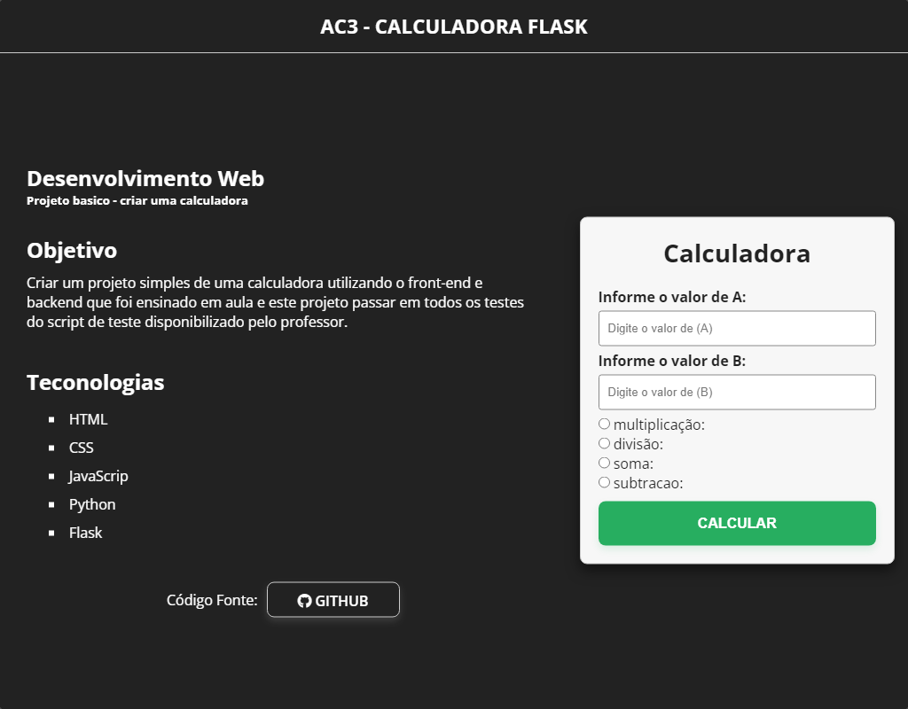

# AC3 - Desenvolvimento Web

  

# 🖌️ Objetivo:
Criar um projeto simples de uma calculadora que tenha um front-end que consuma os dados do backend e apresente em tela.

## 💻 Linguagens

    
    
    
    
    

## 📃 Editor de código

  

